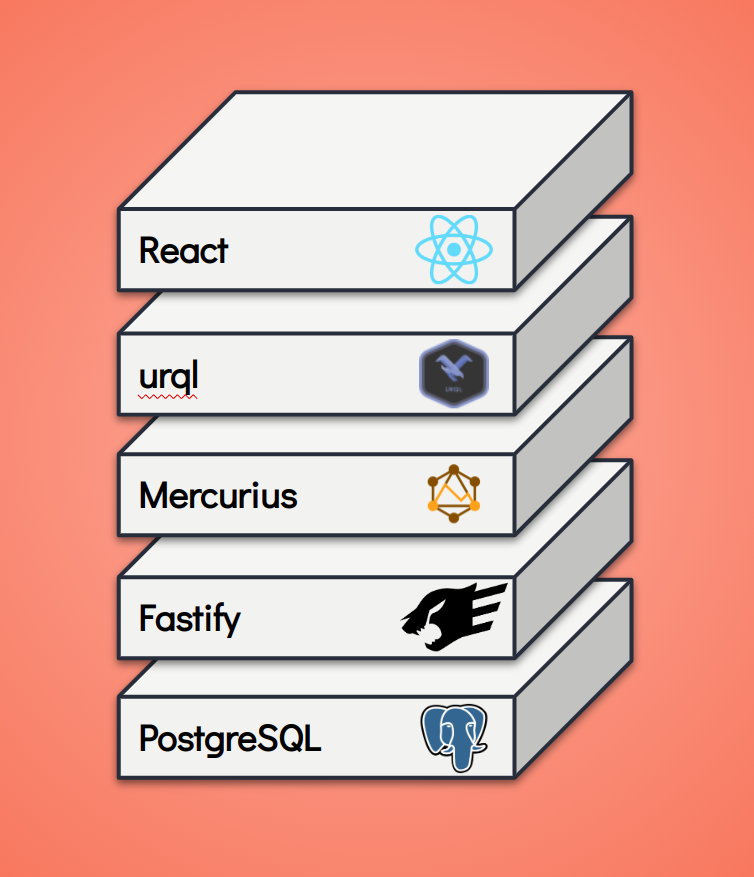

# mfs.js

Modern full-stack javascript



This repo serves a POC of my talk on modern full-stack javascript.

## Setup

1. Clone
2. Start the db:
   ```bash
   npm run db:up
   ```
3. Add data to the db (only need to do this once):
   ```bash
   npm run db:migrate
   ```
4. Run the stack:
   ```bash
   npm run dev
   ```
